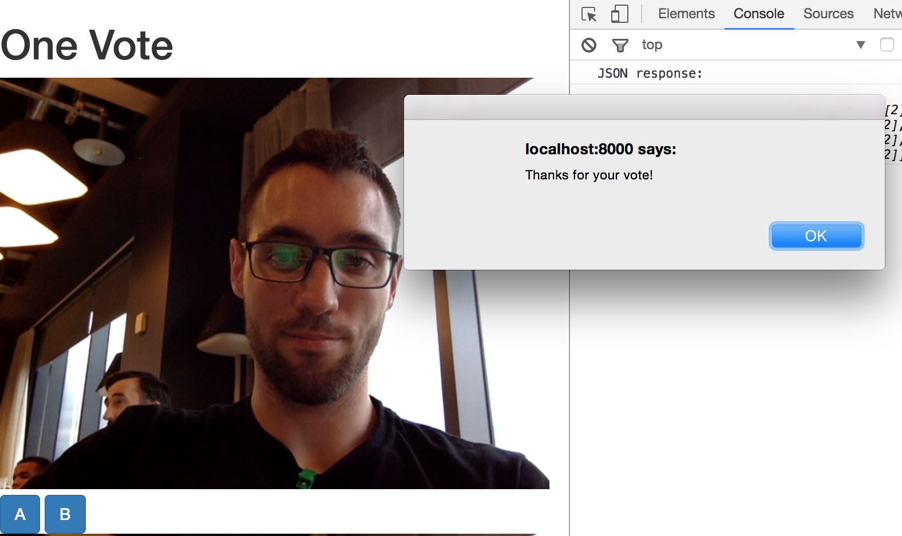
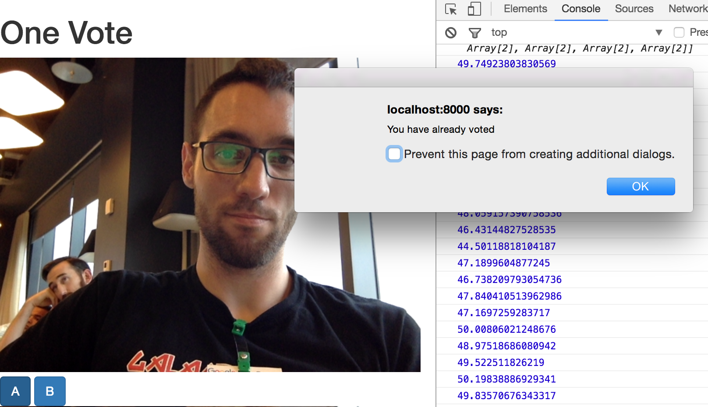

# One Vote

This is the project I presented at devfest 2016 hackathon.

It is a voting system that prevents the users to vote more than one time:

1. A picture of the face of the user is taken at the moment of the vote
2. Gets the face landmarks via Google Cloud Vision API
3. Iterates over the face landmarks of previous voters and checks the euclidean distance with the current one.
    - If it is bigger than the threshold, the vote is disallowed.
    - Else, the vote is stored in the Firebase database including the face landmarks matrix.

It makes use of the following services:

- Firebase
- Google Cloud Vision

And depends on the `mathjs` library.

Possible usages (thanks to the public that suggested them):

- Satisfaction buttons at the airports
- ATMs

Further work:
- Align the faces, right now it doesn't work well if the position and distance of the faces to the camera change too much.
- Explore other face similarity methods.

Part of the code was based on this Cloud Vision API usage sample webapp: https://demobuddy.firebaseapp.com/
